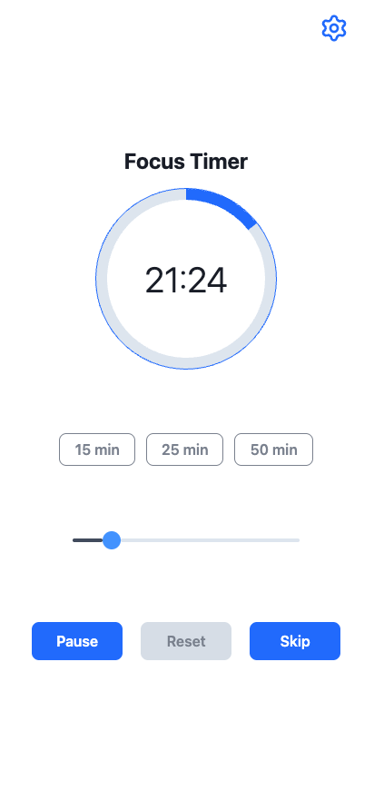
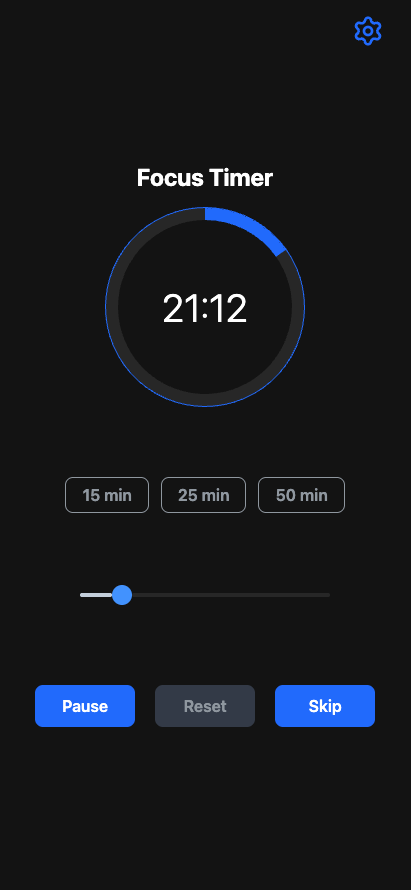
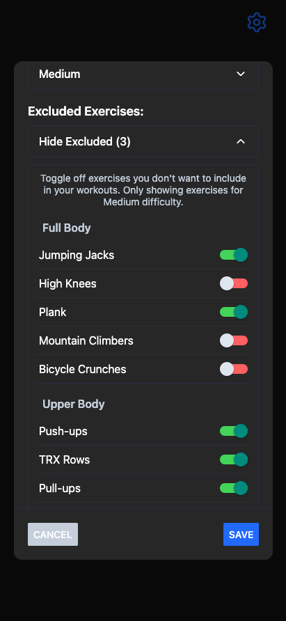
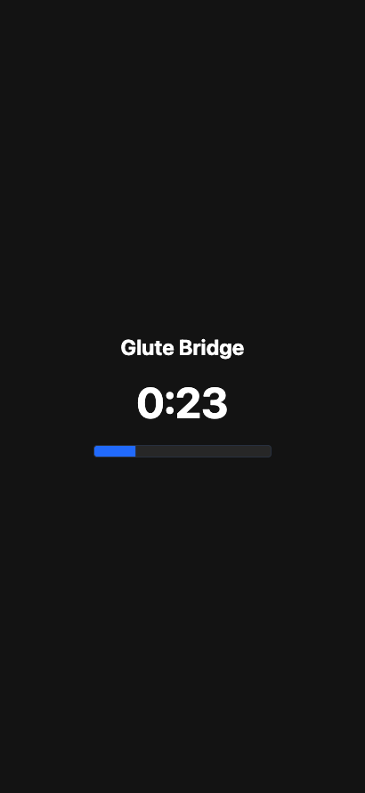
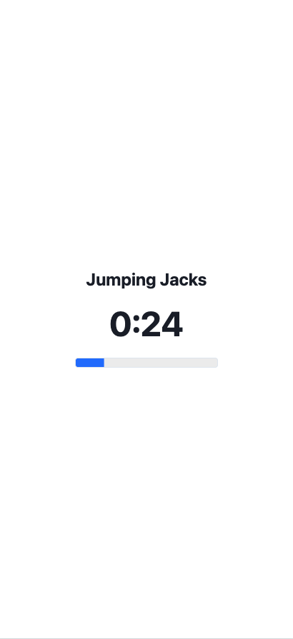

# FocusFit

> Focus Deeply. Move Your Body. Build Habits.

A comprehensive productivity and fitness app that combines focused work sessions with energizing exercise routines. Build consistent habits with smart notifications, personalized workouts, and detailed progress tracking.

## ✨ Features

### 🎯 **Focus & Productivity**

- **Customizable Focus Timer**: Set your preferred focus duration (5-120 minutes)
- **Auto-Start Timer**: Seamless onboarding flow that starts your first session
- **Focus Time Modal**: Easy time adjustment with slider interface
- **Visual Feedback**: Progress indicators and completion celebrations
- **Focus Sessions Tracking**: Complete history of all your focus sessions
- **Streak Tracking**: Build momentum with focus and workout streaks
- **Encouraging Messages**: Motivational phrases during focus sessions

### 💪 **Smart Workouts**

- **30 Office-Friendly Exercises**: Upper body, lower body, and mobility routines
- **Multiple Difficulty Levels**: Easy, medium, and hard options to match your fitness level
- **Equipment Support**: Desk, chair, bodyweight, TRX, kettlebells, pull-up bars, and resistance bands
- **Exercise Customization**: Exclude exercises you don't want to do
- **Step-by-Step Instructions**: Clear, detailed instructions for each exercise
- **Real-time Guidance**: Countdown timers and progress tracking
- **Workout History**: Track all your completed workouts

### 📊 **Analytics & Progress**

- **Comprehensive Analytics**: Detailed insights into your focus and workout patterns
- **Achievement System**: 12 achievements to unlock as you progress
- **Progress Tracking**: Total sessions, duration, and streak monitoring
- **Visual Analytics**: Beautiful charts and metrics display
- **Recent Activity**: Track your last 7 days of activity
- **Streak Monitoring**: Focus and workout streak tracking with visual indicators

### 🔔 **Smart Notifications**

- **Daily Reminders**: Morning focus reminders to build consistent habits
- **Motivational Boost**: Afternoon reminders to maintain momentum
- **Customizable Timing**: Set your preferred reminder times
- **Cross-Platform**: Works on both iOS and Android with proper notification channels
- **Timer End Notifications**: Get notified when your focus sessions complete

### 🎨 **Personalization**

- **Theme Support**: Light, dark, and system theme options
- **Equipment Selection**: Choose what equipment you have available
- **Difficulty Preferences**: Set your preferred workout difficulty
- **Exercise Exclusions**: Customize your workout experience
- **Notification Preferences**: Control when and how you get reminded
- **User Settings**: Persistent preferences across sessions

### 📱 **Offline Support**

- **Offline Functionality**: Continue using the app without internet connection
- **Automatic Sync**: Data syncs when connection is restored
- **Local Storage**: Sessions and progress saved locally when offline
- **Seamless Experience**: No interruption to your workflow
- **Offline Data Export**: Export pending offline data with your exports

### 📤 **Data Export & Privacy**

- **Complete Data Export**: Export all your FocusFit data
- **Multiple Formats**: JSON and CSV export options
- **Offline Data Included**: Export pending offline data
- **Comprehensive Reports**: Detailed summaries and statistics
- **Privacy Control**: Full control over your personal data
- **Data Validation**: Built-in data integrity checks

### 🔐 **Authentication & Security**

- **Multiple Sign-In Options**: Google, Apple, and Email/Password authentication
- **Secure Data Storage**: Firebase Firestore with proper security rules
- **User Privacy**: Complete data ownership and export capabilities
- **Cross-Platform Auth**: Seamless authentication across iOS and Android

## 📱 Screenshots

<p align="center">
  
  &nbsp;&nbsp;&nbsp;&nbsp;
  
  &nbsp;&nbsp;&nbsp;&nbsp;
  
</p>

<p align="center">
  
  &nbsp;&nbsp;&nbsp;&nbsp;
  
</p>

## 🚀 Installation

### Prerequisites

- Node.js (v18 or higher)
- npm or yarn
- Expo CLI (`npm install -g @expo/cli`)
- iOS Simulator (for iOS development) or Android Studio (for Android development)
- Firebase project (for authentication and data storage)

### Setup

1. **Clone the repository:**
   ```bash
   git clone git@github.com:corygold-dev/FocusFit.git
   cd FocusFit
   ```

2. **Install dependencies:**
   ```bash
   npm install
   ```

3. **Configure Firebase:**
   
   Create a Firebase project at [Firebase Console](https://console.firebase.google.com/) and:
   
   - Enable Authentication with Google, Apple, and Email/Password providers
   - Create a Firestore database
   - Download your `google-services.json` (Android) and `GoogleService-Info.plist` (iOS)
   - Update `src/config/firebase.ts` with your Firebase configuration
   
   ```typescript
   // src/config/firebase.ts
   const firebaseConfig = {
     apiKey: "your-api-key",
     authDomain: "your-project.firebaseapp.com",
     projectId: "your-project-id",
     storageBucket: "your-project.appspot.com",
     messagingSenderId: "your-sender-id",
     appId: "your-app-id"
   };
   ```

4. **Start the development server:**
   ```bash
   npx expo start
   ```

### Running on Devices

- **iOS Simulator**: Press `i` in the terminal after starting the app
- **Android Emulator**: Press `a` in the terminal after starting the app
- **Physical Device**: Scan the QR code with the Expo Go app
- **Web Browser**: Press `w` in the terminal after starting the app

## 🛠 Tech Stack

### Core Framework
- **React Native**: 0.79.5 - Cross-platform mobile development
- **Expo**: ~53.0.23 - Development platform and tools
- **TypeScript**: ~5.8.3 - Type safety and enhanced developer experience

### Navigation & Routing
- **Expo Router**: ~5.1.7 - File-based routing system
- **React Navigation**: Built-in navigation components

### Backend & Authentication
- **Firebase**: ^12.3.0 - Backend services and authentication
- **Firebase Auth**: Google, Apple, and Email/Password authentication
- **Firebase Firestore**: Real-time database for user data and sessions
- **Firebase Storage**: Media file storage

### State Management & Data
- **React Context API**: Unified state management with providers
- **AsyncStorage**: ^2.1.2 - Local data persistence
- **React Native NetInfo**: ^11.4.1 - Network connectivity detection

### UI & Styling
- **React Native StyleSheet**: Custom theme system
- **Lucide React Native**: ^0.544.0 - Icon library
- **React Native SVG**: ^15.11.2 - Vector graphics support
- **React Native Reanimated**: ~3.17.4 - Smooth animations

### Notifications & Audio
- **Expo Notifications**: ~0.31.4 - Cross-platform notifications
- **Expo Audio**: ~0.4.9 - Custom sound effects
- **Expo Haptics**: ~14.1.4 - Tactile feedback

### Development Tools
- **ESLint**: ^9.35.0 - Code linting and formatting
- **Prettier**: ^3.6.2 - Code formatting
- **TypeScript ESLint**: ^8.43.0 - TypeScript-specific linting rules

## 📁 Project Structure

```
FocusFit/
├── app/                           # Expo Router screens
│   ├── (app)/                    # Protected app screens
│   │   ├── index.tsx             # Main timer screen
│   │   ├── exercise.tsx          # Exercise workflow
│   │   └── onboarding.tsx         # First-time user experience
│   ├── sign-in.tsx               # Authentication screens
│   └── sign-up.tsx
├── src/                          # Source code
│   ├── components/               # UI components by feature
│   │   ├── analyticsModal/       # Analytics and progress tracking
│   │   ├── authScreen/           # Authentication UI components
│   │   ├── exerciseScreen/       # Exercise-related components
│   │   ├── settingsModal/        # Settings and data export
│   │   ├── timerScreen/          # Timer and focus components
│   │   ├── workoutChoiceModal/   # Workout selection
│   │   └── ui/                   # Shared UI components
│   ├── providers/                # React Context providers
│   │   ├── AuthProvider.tsx      # Authentication and data management
│   │   ├── NotificationProvider.tsx # Daily reminders
│   │   ├── ThemeProvider.tsx     # Theme management
│   │   ├── SoundProvider.tsx     # Audio management
│   │   ├── TimerProvider.tsx     # Timer state management
│   │   └── WorkoutProvider.tsx   # Workout state management
│   ├── services/                 # Business logic and API calls
│   │   ├── FirebaseAuthService.ts    # Authentication operations
│   │   ├── FirebaseDataService.ts     # Database operations
│   │   ├── SimpleOfflineService.ts   # Offline data management
│   │   ├── DataExportService.ts      # Data export functionality
│   │   └── FeedbackService.ts        # User feedback system
│   ├── hooks/                    # Custom React hooks
│   │   ├── exercise/             # Exercise-related hooks
│   │   └── timer/                # Timer-related hooks
│   ├── utils/                    # Helper functions and constants
│   │   ├── achievements.ts       # Achievement system (12 achievements)
│   │   ├── exerciseUtils.ts      # Exercise utilities
│   │   ├── notifications.ts     # Notification system
│   │   └── formatTime.ts         # Time formatting utilities
│   ├── lib/                      # Data definitions
│   │   └── exercises.ts          # Exercise library (30 exercises)
│   └── styles/                   # Global theme and styling
├── assets/                       # Images, audio, and static files
└── config/                       # App configuration
```

## 🔧 Development

### Key Files

- `app/(app)/index.tsx`: Main timer screen with auto-start functionality
- `app/(app)/exercise.tsx`: Exercise workflow with step-by-step instructions
- `app/(app)/onboarding.tsx`: First-time user experience
- `src/providers/AuthProvider.tsx`: Authentication and data management
- `src/services/FirebaseDataService.ts`: Database operations and user profile management
- `src/services/SimpleOfflineService.ts`: Offline data persistence and sync
- `src/services/DataExportService.ts`: Data export functionality
- `src/utils/notifications.ts`: Daily reminder system
- `src/utils/achievements.ts`: Achievement system with 12 unlockable achievements
- `src/lib/exercises.ts`: Exercise library with 30 detailed exercises
- `src/config/firebase.ts`: Firebase configuration and initialization

### Key Features Implementation

#### Authentication & Data Management
- **Firebase Integration**: Complete user authentication with Google, Apple, and email/password
- **Offline Support**: Automatic data sync when connection is restored
- **Data Export**: Comprehensive JSON/CSV export with metadata
- **User Privacy**: Complete data ownership and export capabilities

#### Analytics & Progress Tracking
- **Achievement System**: 12 achievements with progress tracking
- **Analytics Dashboard**: Comprehensive insights into user patterns
- **Streak Tracking**: Focus and workout streak monitoring
- **Progress Visualization**: Beautiful charts and metrics display

#### Exercise System
- **30 Office-Friendly Exercises**: Upper body, lower body, and mobility routines
- **Step-by-Step Instructions**: Clear, detailed instructions for each exercise
- **Equipment Customization**: Choose available equipment and exclude unwanted exercises
- **Difficulty Levels**: Easy, medium, and hard options
- **Smart Selection**: AI-powered workout recommendations

#### Notification System
- **Daily Reminders**: Smart notification scheduling with user preferences
- **Cross-Platform**: iOS and Android notification channels
- **Customizable**: Users can enable/disable different reminder types
- **Sound Integration**: Custom audio cues for different notification types

## 🤝 Contributing

1. Fork the repository
2. Create your feature branch: `git checkout -b feature/amazing-feature`
3. Commit your changes: `git commit -m 'Add some amazing feature'`
4. Push to the branch: `git push origin feature/amazing-feature`
5. Open a Pull Request

## 📄 License

This project is licensed under a proprietary license - see the [LICENSE](LICENSE) file for details.

The FocusFit application and its source code are copyright © 2024 Cory Gold. All rights reserved.

This software is protected under copyright law and international treaties. No part of this software may be reproduced, distributed, or transmitted in any form or by any means without the prior written permission of the copyright owner.

## 🙏 Acknowledgments

- [Expo](https://expo.dev) - The React Native framework used
- [Firebase](https://firebase.google.com/) - Backend services and authentication
- [React Native Community](https://reactnative.dev/community/overview) - For their amazing components and tools
- [Lucide](https://lucide.dev/) - Beautiful icon library
- [React Native Reanimated](https://docs.swmansion.com/react-native-reanimated/) - Smooth animations

---

_Built with ❤️ for productivity and fitness enthusiasts_